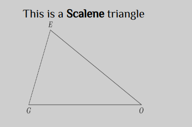
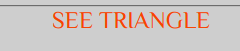

# TRIANGLE TRACKER

## Project Definition
This is a simple website used to determine the different types of triangles when the user enters different values.The program returns either a scalene triangle, equillateral triangle, isosceless triangle or No triangle depending on the entered values.

# AUTHOR'S INFORMATION
The project is written and coded by John Muasa Wathome, a junior web developer at Moringa School.

# SETUP INSTRUCTIONS
Once you load the program you go straight to the landing page.

You can now enter your values

After entering your values click on the **SUBMIT** buttton then press See triangles

You will now be able to see the type of triangle depending on the input rendered.

# BEHAVIOUR DRIVEN DEVELOPMENT

| BEHAVIOUR          | INPUT EXAMPLE     |     OUTPUT EXAMPLE    |
| :-------------        | :------------- | :------------------
| When values entered cant make a triangle       | 9 4 3      | THIS IS NOT A TRIANGLE |
| When values entered make an equillateral triangle | 6 6 6    | EQUILLATERAL TRIANGLE  |
| When values entered make an isosceless triangle  | 7 7 8    |  ISOSCELESS TRIANGLE |
| When values entered make a scalene triangle |  8 6 5 | SCALENE TRIANGLE |
| When non - numeric values are entered |  8 b c| ENTER NUMERIC VALUES |

## TECHNOLOGIES USED
The main languages used were **HTML**, **CSS** and **JAVASCRIPT**

## CONTACT INFORMATION
By me some tea through my email address : <muasajohn01@gmail.com>
